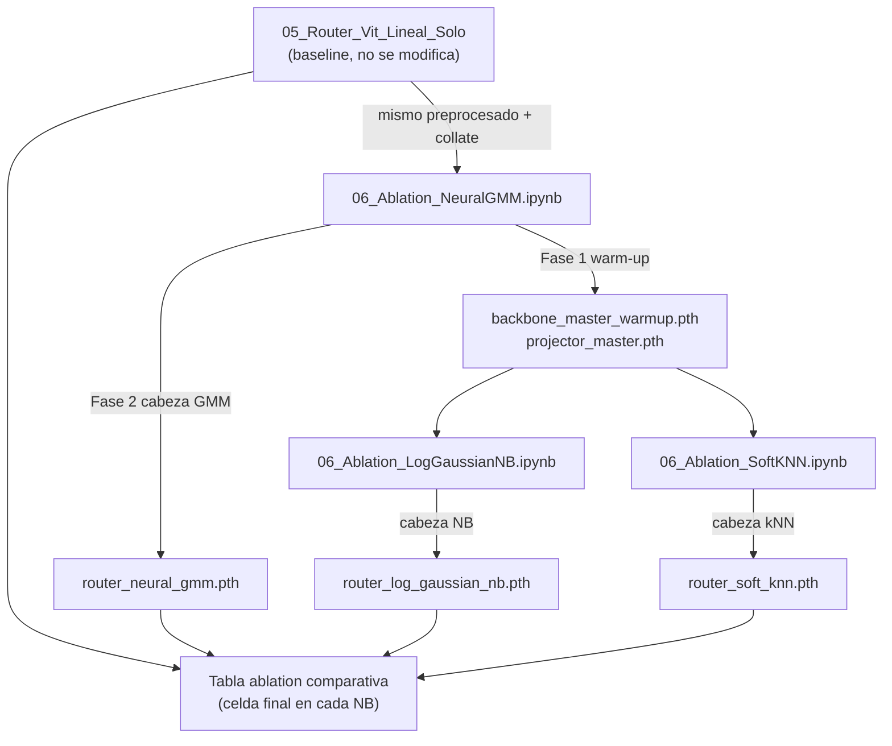

# Plan: Ablation Router - Tres Notebooks Probabilisticos

## Base de referencia

Todo el codigo de preprocesado, expertos y entrenamiento se copia (sin modificar) de
[notebooks/05_Router_Vit_Lineal_Solo.ipynb](notebooks/05_Router_Vit_Lineal_Solo.ipynb):
`AdaptivePreprocessor`, `mixed_collate_fn`, `WeightedRandomSampler`, `_switch_aux_loss`,
`set_train_router_mode`, `fit_router_with_eval`, `eval_router_on_cls`.

## Flujo entre notebooks



## Notebook 1: `06_Ablation_NeuralGMM.ipynb`

### Fase 1 - Warm-up maestro (unica vez, los otros dos NB cargan este ckpt)

- `VisionRouter` del 05 Lineal + `projector = nn.Linear(192, 64)` + `proxy_head = nn.Linear(64, 5)`.
- Loss: `L_routing + alpha_aux * L_aux` (sin `L_task` en warm-up para estabilizar primero).
- Guardar al finalizar: `backbone_master_warmup.pth` (estado de `vit`), `projector_master.pth`.
- Extraer y guardar `unified_z_64.npz` (Z_train, Z_val) para uso offline si se necesita.

### Fase 2 - Cabeza NeuralGMM

```python
class NeuralGMMHead(nn.Module):
    def __init__(self, d_z=64, n_experts=5):
        super().__init__()
        self.mu       = nn.Parameter(torch.randn(n_experts, d_z))
        self.log_sigma = nn.Parameter(torch.zeros(n_experts, d_z))  # log para garantizar sigma > 0

    def forward(self, z):  # z: [B, d_z]
        # log N(z; mu_c, diag(exp(log_sigma_c))) sumado sobre dimensiones
        sigma = self.log_sigma.exp().clamp(min=1e-4)   # [K, d_z]
        diff  = z.unsqueeze(1) - self.mu.unsqueeze(0)  # [B, K, d_z]
        log_p = -0.5 * ((diff / sigma) ** 2 + 2 * self.log_sigma + math.log(2 * math.pi)).sum(-1)
        return log_p  # [B, K] -> usar como logits en L_routing
```

- Entrenar con `L_routing(log_p, y_domain) + L_task + alpha_aux * L_aux`.
- Guardar: `router_neural_gmm.pth`.

## Notebook 2: `06_Ablation_LogGaussianNB.ipynb`

- Cargar `backbone_master_warmup.pth` + `projector_master.pth`.
- Descongelar ultimos `N_UNFREEZE_BLOCKS = 6` bloques del ViT (configurable).
- Cabeza identica a NeuralGMM pero **interpretada como NB**: misma formula, pero los parametros se inicializan con estadisticas de `Z_train` por clase (desde `unified_z_64.npz`) en lugar de aleatoriamente, lo que acelera convergencia y hace el paralelo con GaussianNB de sklearn.
- Guardar: `router_log_gaussian_nb.pth`.

## Notebook 3: `06_Ablation_SoftKNN.ipynb`

- Cargar `backbone_master_warmup.pth` + `projector_master.pth`.
- Descongelar ultimos `N_UNFREEZE_BLOCKS = 6` bloques del ViT.
- Cabeza SoftKNN:

```python
class SoftKNNHead(nn.Module):
    def __init__(self, d_z=64, n_experts=5):
        super().__init__()
        self.prototypes = nn.Parameter(torch.randn(n_experts, d_z))
        self.log_tau    = nn.Parameter(torch.zeros(1))  # temperatura aprendible

    def forward(self, z):  # z: [B, d_z]
        tau  = self.log_tau.exp().clamp(min=1e-2)
        dist = torch.cdist(z, self.prototypes) ** 2  # [B, K]
        return -dist / tau  # logits: mayor score = prototipo mas cercano
```

- Inicializar `prototypes` con centroides por clase de `Z_train` (K-means o media por clase).
- Guardar: `router_soft_knn.pth`.

## Metricas identicas en los tres notebooks

| Metrica | Como se calcula |
|---------|----------------|
| Routing accuracy | `argmax(logits) == y_domain` en val |
| Ratio max/min | `max(freq_experto) / min(freq_experto)` objetivo <= 1.30 |
| Entropia media | `mean(H(softmax(logits)))` en val |
| CM 5x5 | Con `mixed_collate_fn` (ya existe en 05 Lineal, copiar sin cambios) |
| Grad-CAM | Score = logit de la clase predicha por la cabeza activa |

## Notas criticas de implementacion

- `mixed_collate_fn` ya existe en el 05 Lineal y resuelve el bug de stack 2D/3D: copiar sin cambios.
- NeuralGMM y LogGaussianNB son **modelos diferenciables end-to-end**, no sklearn. Nombrarlos distintos en el informe para no confundir con el ablation estadistico offline.
- `log_sigma` y `log_tau` siempre como parametros (no `sigma` directo) para evitar inestabilidad numerica.
- Los tres notebooks guardan checkpoints con nombres distintos para no pisar el baseline del 05 Lineal.
- La **celda comparativa final** es identica en los tres notebooks: carga todos los ckpts disponibles y genera la tabla de ablation.
