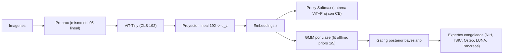

# Por que importa "Fast Deep Mixtures of Gaussian Process Experts" para nuestro proyecto

Referencia: `guides/ablation VIT/Gaussian/Fast Deep Mixtures of Gaussian Process Experts.md` (Etienam, Law, Wade, Zankin, 2023).

El paper no se aplica "tal cual" a nuestro pipeline (ellos resuelven regresion, nosotros clasificacion / enrutamiento entre dominios medicos), pero comparte tres puntos centrales con lo que estamos haciendo:

1. **Un router neuronal decide a que experto va cada punto.**
2. **Los expertos son distribuciones (Gaussianas), no clasificadores rigidos.**
3. **Hay una fase rapida de inicializacion (CCR) y otra opcional iterativa (MM).**

Eso conecta directamente con el ablation study que estamos planteando: ViT + proyector lineal + cabeza estadistica (GMM, NB, k-NN).

---

## 1. Mapeo paper -> nuestro MoE

| Concepto del paper | Equivalente en el proyecto |
|--------------------|----------------------------|
| Gating DNN `w_l(x; psi)` con softmax | Cabeza proxy lineal sobre `z = W * CLS_ViT` durante el entrenamiento. |
| Allocation variables `z_i in {1..L}` | Etiqueta de experto (NIH, ISIC, Osteo, LUNA, Pancreas). |
| Expertos GP | En nuestro caso son CNN/ViT 2D y R3D-18 3D ya entrenados, pero **el GMM ablation cumple el rol de "experto generativo en el espacio z"** para el routing. |
| Sparse GP / inducing points | Equivalente conceptual: "memory bank" / centroides para k-NN; medias y covarianzas por clase para GMM. |
| Algoritmo CCR (Cluster-Classify-Regress) | Plantilla para nuestra estrategia "proxy diferenciable + ajuste estadistico" en una pasada. |
| MM iterativo | Refinamiento opcional: re-asignar `z` con el GMM y re-entrenar el proxy. |

---

## 2. Lo que podemos tomar prestado directamente

### 2.1 Justificacion teorica del esquema MoE con gating discriminativo

Seccion 2 del paper formaliza el MoE con:

```
y_i | x_i ~ sum_l w_l(x_i; psi) * N(y_i | f(x_i; theta_l), sigma_l^2)
```

y argumenta que **un gating profundo es mas flexible** que clasificadores cuadraticos o lineales. Eso da soporte bibliografico al uso de **ViT como router** frente a una linear / logistic regression sobre `z`. Util para la sustentacion ante el profesor.

### 2.2 Generativo vs discriminativo en el gating

El paper distingue (Sec. 2.2):

- **Gating generativo**: modela `p(x | clase)` con Gaussianas (LDA, QDA, mixturas). Es exactamente lo que hace **GMM por clase con priors uniformes** en nuestra variante de ablation.
- **Gating discriminativo**: modela directamente `p(clase | x)` con DNN o softmax. Equivale a la cabeza proxy diferenciable del 05 lineal.

Esto nos permite presentar el ablation como una **comparacion principios primeros**:
"baseline discriminativo (lineal) vs decisor generativo (GMM) sobre el mismo espacio latente `z`".

### 2.3 Algoritmo CCR como plantilla para el flujo del notebook

El CCR del paper (Sec. 3.2) hace en una pasada:

1. **Cluster** de los datos en el espacio (re-escalado).
2. **Classify**: entrena el clasificador / gating sobre las asignaciones.
3. **Regress**: ajusta los expertos sobre cada particion.

Nuestro flujo paralelo para el ablation con GMM seria:



Es CCR adaptado: **Cluster** lo reemplaza la supervision por dataset; **Classify** es el ViT+proxy; **Regress** son los expertos ya entrenados.

### 2.4 Maximization-Maximization (MM) como receta para refinamiento

La Seccion 3.1 sugiere alternar:

- (i) actualizar asignaciones `z_i` segun el modelo actual,
- (ii) re-optimizar gating + expertos.

Aplicable a nosotros como **iteracion opcional** despues de la primera pasada CCR:

1. Entrenar proxy (lineal) con etiquetas de dataset -> obtener `z`.
2. Ajustar GMM por clase sobre `z`.
3. Re-asignar muestras dudosas usando el posterior del GMM (no el dataset de origen).
4. Re-entrenar proxy con esas nuevas asignaciones (curriculum suave).

El paper observa que "MM con 2 pasadas (MM2r) ya alcanza buen rendimiento" -> en la practica una sola iteracion de refinamiento suele bastar.

### 2.5 Hard vs soft allocation para inferencia

Seccion 3.4 distingue:

- **Hard allocation**: top-1 del gating, una decision unica.
- **Soft allocation**: mezcla ponderada de todos los expertos.

Para el MoE medico esto importa: en clases tipicas (Osteo, ISIC) hard top-1 es suficiente; pero en **muestras OOD o ambiguas** la soft allocation con pesos del GMM da mejor calibracion. Encaja con la propuesta de **OOD via baja log-verosimilitud** del GMM.

### 2.6 Cuantificacion de incertidumbre y deteccion OOD

El paper insiste en que GP / GMM aportan **uncertainty quantification** que las DNN puras no dan. Concreto para nosotros:

- Calcular `log p(z | clase l)` bajo cada GMM por clase.
- Si el maximo log-likelihood normalizado cae por debajo de un umbral, marcar OOD (alineado con la celda OOD del dashboard, `compute_entropy`, pero usando densidad en vez de entropia del softmax).

---

## 3. Conceptos puntuales del paper que iran al informe

| Concepto | Pagina/seccion | Como usarlo |
|----------|----------------|-------------|
| Definicion formal de MoE con gating + experts | Sec. 2, ec. (1) | Justifica el formalismo del proyecto. |
| Gating discriminativo DNN + softmax | Sec. 2.2, ec. (10) | Sustenta el uso del ViT como router. |
| GMM como gating generativo (LDA/QDA y mezcla por clase) | Sec. 2.2 (Yuan & Neubauer, Gadd et al.) | Da pedigree al ablation con GMM. |
| MM algoritmo (allocate / fit) | Sec. 3.1, ec. (6) | Plantilla para refinamiento iterativo opcional. |
| CCR algoritmo en una pasada | Sec. 3.2 | Plantilla para pipeline rapido (lo que estamos haciendo). |
| Hard vs soft allocation | Sec. 3.4, ec. (13)-(14) | Justifica dos modos de inferencia: top-1 vs mezcla ponderada. |
| Deteccion de OOD via baja verosimilitud / coverage | Sec. 4.3, Tabla 3 | Sustenta la metrica OOD basada en densidad del GMM. |
| Coste O(N * P_max) de CCR vs MM | Sec. 3.3 | Util para argumentar viabilidad en GPU 12 GB. |

---

## 4. Diferencias importantes (no copiar literal)

1. **Tarea**: el paper hace regresion `y in R`, nosotros hacemos enrutamiento (clasificacion en {NIH,ISIC,Osteo,LUNA,Pancreas}). Las ecuaciones de likelihood Gaussiana no aplican al output, **pero si al espacio latente `z`** que es donde corre nuestro GMM.
2. **Expertos**: ellos usan sparse GP entrenables; nosotros usamos CNN/ViT/R3D-18 **congelados**. El gradiente del task loss no debe atravesar el bloque GMM, lo resolvemos con la **proxy lineal diferenciable** (ya discutido en `docs/analisis_router_flujo_ablation_gradcam.md`).
3. **Inducing points y FITC**: no aplican; en su lugar el equivalente practico es **submuestrear el train para el fit del GMM** si la matriz de covarianza por clase se vuelve cara.
4. **Numero de expertos `L`**: ellos lo eligen con BIC; nosotros lo fijamos a 5 (uno por dataset). El BIC nos sirve si quisieramos **subdividir** un dominio (p. ej. NIH en sub-clases) en una extension futura.

---

## 5. Conclusion practica

Lo que justifica leer este paper para el proyecto es:

- Da **fundamento teorico** al esquema "router neuronal + decisor estadistico" que estamos defendiendo en el ablation.
- El **CCR** valida que la estrategia "una pasada de proxy + fit GMM offline" no es un atajo: es una aproximacion al MAP del MoE completo.
- Aporta **vocabulario y metricas** (hard/soft allocation, empirical coverage, MM refinement, gating generativo vs discriminativo) que elevan la sustentacion tecnica.
- Sugiere de forma natural el camino de **deteccion OOD basada en log-verosimilitud del GMM**, que es exactamente lo que el dashboard ya intenta con entropia del softmax pero con mejor calibracion.

En el informe se cita como respaldo de:

1. La eleccion de **gating ViT** (discriminativo flexible).
2. La eleccion de **GMM por clase con priors uniformes** (gating generativo + balanceo).
3. El **protocolo de dos fases** (proxy diferenciable + fit estadistico), interpretado como CCR adaptado.
4. La **opcion de OOD por densidad** sobre el espacio `z`.
