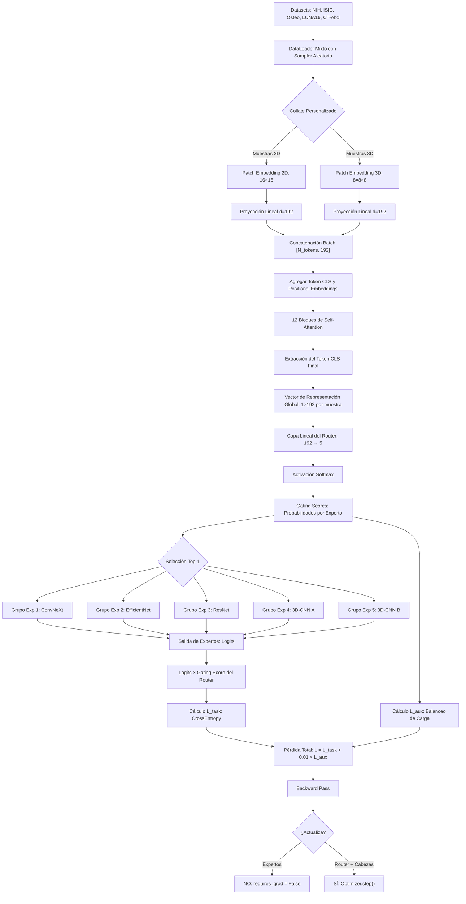

# Apuntes y Recomendaciones — Reunión con el Profesor

**Proyecto:** Visión Clasificación Médica con Mixture of Experts (MoE)  
**Notebook referencia:** `02_Preprocesamiento_Multiple_Adaptive.ipynb`  
**Fecha de registro:** 2026-03-27

---

## 1. Data Augmentation: ¿Antes o después del preprocesamiento?

> **Pregunta clave:** ¿El data augmentation de cada dataset por cada imagen es antes o después del preprocesamiento?

**Recomendación del profesor:**
- El data augmentation debe aplicarse **después** del preprocesamiento adaptativo, de forma que las imágenes ya estén en su forma nativa normalizada (`[C, 224, 224]` para 2D y `[1, 64, 64, 64]` para 3D).
- La razón es que el augmentation debe actuar sobre datos ya homogeneizados para mantener consistencia en las distribuciones.

---

## 2. Normalización homogénea en la entrada

> En la entrada, las mismas cualidades de normalización. Brillo, contraste.

**Recomendaciones:**
- Todas las entradas deben pasar por un proceso de **normalización uniforme** en brillo y contraste antes de alimentar al modelo.
- Aplicar corrección de **gamma** a las imágenes para que **no sean tan brillantes**.
- Revisar las **distribuciones de histogramas** de cada dataset para asegurar que la normalización esté funcionando correctamente y las distribuciones sean comparables entre datasets.

---

## 3. Tamaño de muestra para el embedding CLS

> **Pregunta clave:** ¿De cuánto debe ser la muestra del dataset para nuestro embedding de CLS?

**Contexto:**
- El Router usa un ViT que genera un token CLS con representación global de `1×192` por muestra.
- El tamaño de muestra debe ser suficiente para que el router aprenda a distinguir entre los 5 tipos de datos médicos.

> [!IMPORTANT]
> Definir el tamaño de muestra considerando el balance entre datasets y la capacidad de VRAM disponible.

---

## 4. Orden de entrenamiento: Expertos → Cabezas → Todo junto

> ¿Entrenamos primero los expertos, después las cabezas, y después todo junto?

**Recomendación del profesor:**
1. **Primero**: Los expertos **deben estar pre-entrenados desde antes** porque ellos son los que devuelven un tensor de clasificación al Router.
2. **Segundo**: Se entrenan las cabezas de clasificación.
3. **Tercero**: Se entrena todo junto (fine-tuning end-to-end).

> [!IMPORTANT]
> Los expertos **sí o sí deben estar desde antes** porque es una **conversación entre el Router y los Expertos**: el Router recibe un tensor con las 5 probabilidades (gating scores), analiza y equilibra la carga, y retorna un vector de probabilidades con ranking.

---

## 5. Corrección de brillo con Gamma

> Imágenes cambiándole el gamma para que **no sean tan brillantes**.

**Acción:**
- Implementar corrección gamma en el `AdaptivePreprocessor` o como un paso de augmentation.
- Esto es especialmente relevante para datasets como ISIC (dermatología) y NIH (rayos X).

---

## 6. Distribuciones de histogramas

> Las distribuciones de histogramas.

**Acción:**
- Generar y comparar histogramas de intensidad de los 5 datasets **después** del preprocesamiento.
- Verificar que las distribuciones sean razonablemente similares para que el Router no tenga sesgo por diferencias de intensidad.

---

## 7. Medición de VRAM

> Medición de cuánta VRAM se va en el entreno de los diseños. El MoE está consumiendo con batches mixtos.

**Acciones:**
- Medir el consumo de VRAM para cada configuración de entrenamiento.
- Optimizar el uso de batches mixtos para reducir consumo.
- Documentar qué diseño consume más/menos recursos.

---

## 8. Homogeneización dimensional del volumen

> Colocar el volumen en una sola dimensionalidad. Pasarle unos embeddings.

**Concepto clave:**
- Los datos 3D (LUNA16, Páncreas) y 2D (NIH, ISIC, Osteo) deben converger a una **representación dimensional homogénea** antes de entrar al Router.
- Esto se logra a través de los **Patch Embeddings** diferenciados (2D: `16×16`, 3D: `8×8×8`) seguidos de una **proyección lineal** a `d=192`.

---

## 9. Función faltante: Pasos A → H (DataLoader Mixto)

> **Del punto A al punto H es el primer proyecto.** Crear Data Loader Mixto que convierta esas entradas en una dimensional homogénea. Falta una función para hacer los pasos A a H.

> [!CAUTION]
> **Actualmente falta esta función crítica.** Se debe implementar el pipeline completo desde los datasets crudos hasta el batch de tokens proyectados.

**Lo que debe hacer la función:**
- Tomar muestras de los 5 datasets (NIH, ISIC, Osteo, LUNA16, CT-Abd/Páncreas).
- Pasar por un **DataLoader Mixto con Sampler Aleatorio**.
- Usar un **Collate Personalizado** que separe muestras 2D y 3D.
- Aplicar **Patch Embedding 2D** (`16×16`) o **Patch Embedding 3D** (`8×8×8`).
- **Proyección Lineal** a `d=192`.
- **Concatenar** el batch en `[N_tokens, 192]`.

> [!NOTE]
> No se le puede dar una clase; tiene que ser **dato crudo**. El sistema debe ser **automático**, que detecte por sí solo a la base de datos de los embeddings/CLS.

---

## 10. SwiT (Switch Transformer) es mejor

> SwiT es mejor. Te quita el token classifier.

**Concepto:**
- Adoptar el enfoque del **Switch Transformer**.
- Elimina el token classifier tradicional.
- El **corrimiento de ventana** (window shifting) es algo importante que puede ayudar para entender cuándo es volumen o imagen.

> [!NOTE]
> No es un modelo, es un **método**. Acá se convierten esas imágenes en **valores característicos** (`1×192`).

---

## 11. Flujo de Entrenamiento del Router (Diagrama del Profesor)

---

## 12. Resumen de Tareas Pendientes

| # | Tarea | Prioridad | Estado |
|---|-------|-----------|--------|
| 1 | Implementar función A→H (DataLoader Mixto + Patch Embeddings + Proyección) | 🔴 Alta | Pendiente |
| 2 | Corrección de gamma para brillo | 🟡 Media | Pendiente |
| 3 | Verificar distribuciones de histogramas entre datasets | 🟡 Media | Pendiente |
| 4 | Normalización homogénea de brillo/contraste | 🟡 Media | Pendiente |
| 5 | Medir consumo de VRAM por configuración | 🟢 Baja | Pendiente |
| 6 | Definir tamaño óptimo de muestra para embedding CLS | 🟡 Media | Pendiente |
| 7 | Pre-entrenar expertos antes del Router | 🔴 Alta | Pendiente |
| 8 | Implementar enfoque Switch Transformer con L_aux | 🔴 Alta | Pendiente |
| 9 | Corrimiento de ventana para detectar volumen vs imagen | 🟡 Media | Pendiente |

---

## 13. Notas Conceptuales Clave

### Router recibe tensor `1×192`
El Router recibe un tensor de representación global de `1×192` por cada muestra. Este vector proviene del **Token CLS** extraído después de 12 bloques de Self-Attention.

### El Router retorna probabilidades con ranking
- El Router tiene una capa lineal `192 → 5` seguida de Softmax.
- Produce **gating scores** (probabilidades por experto).
- Usa selección **Top-1** para asignar la muestra al experto más adecuado.
- La pérdida auxiliar (`L_aux`) con coeficiente `0.01` asegura **balanceo de carga** entre expertos.

### Entrenamiento diferenciado
- **Expertos**: `requires_grad = False` (congelados, ya pre-entrenados).
- **Router + Cabezas**: Se actualizan con `Optimizer.step()`.
- Esto corresponde a la fase de entrenamiento donde solo se ajusta el routing, no los expertos.
