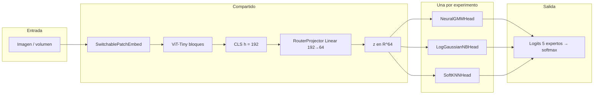

# Cabezas de ablation: de métodos “estadísticos” a capas diferenciables

Este documento resume la **lógica técnica** de las cabezas usadas en:

- `06_Ablation_NeuralGMM.ipynb` → **NeuralGMM** (`NeuralGMMHead`)
- `06_Ablation_LogGaussianNB.ipynb` → **LogGaussianNB** (`LogGaussianNBHead`)
- `06_Ablation_SoftKNN.ipynb` → **SoftKNN** (`SoftKNNHead`)

Todas comparten el mismo **backbone ViT-Tiny** (CLS 192-D), el mismo **`RouterProjector`** lineal **192 → D_Z** (con **D_Z = 64** en el código) y solo cambia la **cabeza** que mapea **z** a logits de 5 expertos.

---

## 1. Idea general (versión “para no especialistas”)

En el estudio **puramente estadístico** (`06_Ablation_Study_Statistical_Routers.ipynb`) ajustas **GMM**, **GaussianNB** o **k-NN** sobre vectores **ya extraídos** y fijos: no hay gradiente por imágenes.

En los notebooks de ablation **neural**, haces algo parecido **en forma de ecuación**, pero implementada con **PyTorch**:

- Los parámetros (medias, varianzas, prototipos, etc.) son **tensores entrenables**.
- La **misma fórmula** que en estadística clásica se escribe como **operaciones diferenciables** (sumas, log, softmax, distancias).
- El optimizador (AdamW) actualiza esos parámetros para minimizar la **entropía cruzada** del routing (y términos auxiliares), en lugar de EM cerrado o contar vecinos en una tabla.

Eso es lo que suele llamarse **“neuralizar”** o **hacer diferenciable** un modelo clásico: **misma historia probabilística**, **optimización distinta** (gradiente estocástico).

---

## 2. Por qué hay un **proyector lineal** compartido (192 → 64)

### Motivos técnicos

1. **Maldición de la dimensionalidad:** comparar distancias o ajustar Gaussianas en 192 dimensiones con pocos datos por experto es frágil; proyectar a **64** es un compromiso habitual (como el PCA en k-NN del estudio estadístico).
2. **Espacio común y comparación justa:** las tres cabezas reciben el mismo **z**; solo cambia cómo puntúan los expertos. Así el ablation aísla el efecto de la **cabeza**, no del backbone.
3. **Entrenamiento conjunto:** el proyector se aprende junto al ViT (según fase) y con la misma pérdida de routing; es la parte **lineal** que adapta el CLS genérico a un espacio donde la cabeza “estadística” trabaja bien.

### Implementación

`RouterProjector`: una capa `Linear(192, 64)` sin activación en el forward (solo lineal). El warm-up con `ProxyLinearHead` entrena proyector + cabeza lineal; luego se cargan pesos y se sustituye la cabeza por GMM / NB / SoftKNN.

---

## 3. Flujo dentro del modelo (esquema)

**Dentro de cada cabeza** (resumen):

| Cabeza | Parámetros principales | Qué calcula sobre cada `z` |
|--------|-------------------------|----------------------------|
| **NeuralGMM** | `mu [5,64]`, `raw_sigma [5,64]`, `log_pi [5]` | Para cada experto \(c\): \(\log \pi_c + \sum_d \log \mathcal{N}(z_d; \mu_{c,d}, \sigma_{c,d}^2)\) (diagonal) |
| **LogGaussianNB** | Igual forma que arriba | Misma fórmula operativa; interpretación **NB** (producto de normales 1D = “naive”) |
| **SoftKNN** | `prototypes [5,64]`, `log_tau` escalar | \(-\|z - \text{proto}_c\|^2 / \tau\) con \(\tau = e^{\log\tau}\) |

El forward devuelve **logits**; el entrenamiento usa típicamente **softmax(logits)** y entropía cruzada respecto al experto verdadero.

---

## 4. Cada cabeza en detalle (técnico + antecedentes)

### 4.1 NeuralGMM (`NeuralGMMHead`)

- **Idea:** Modelar la densidad de **z** condicionada al experto como **Gaussiana con covarianza diagonal** por clase, con pesos de mezcla \(\pi_c\) (softmax de `log_pi`).
- **Logit para la clase c:**  
  \(\text{logit}_c(z) = \log \pi_c + \log \mathcal{N}(z \mid \mu_c, \mathrm{diag}(\sigma_c^2))\)  
  (en el código: suma sobre dimensiones de la log-densidad gaussiana + `log_pi`).
- **Parámetro de escala:** `raw_sigma` → \(\sigma = \mathrm{ELU}(\text{raw}) + 1 + \varepsilon\) (“custom ELU”), para evitar inestabilidad de `exp(log_sigma)` puro.
- **Referencias en el propio notebook:** *García et al.*, trabajo sobre **MDN / mixture density** en routing (MSWiM 2020), con discusión de NLL y Teorema 3.1; la forma es la de **Mixture Density Networks** clásicas (**Bishop**, *Pattern Recognition and Machine Learning*, cap. sobre MDN; paper original de MDN, Bishop 1994).
- **¿Es un modelo de energía?** Puedes ver los logits como **log-probabilidades no normalizadas** de un modelo generativo discriminado (mezcla de expertos). En sentido estricto LeCun-EBM, no es un EBM general; sí es un **modelo energético suave** en el sentido de que cada clase tiene un **score** (log-verosimilitud + log-prior) y el softmax convierte scores en probabilidades.

### 4.2 LogGaussianNB (`LogGaussianNBHead`)

- **Idea:** **Naive Bayes gaussiano:** se asume \(p(z \mid c) = \prod_d p(z_d \mid c)\) con normales 1D → misma **expresión cerrada** que una Gaussiana **diagonal multivariada** por clase.
- **En la práctica del código:** la arquitectura numérica es **la misma** que `NeuralGMMHead` (mismos `mu`, `sigma`, `log_pi`); cambia la **interpretación** y la **inicialización** (estadísticos empíricos por clase sobre `Z_train`, análogo a `GaussianNB` de sklearn).
- **Referencias:** Naive Bayes y QDA diagonal en cualquier libro de ML (Hastie *et al.*, *Elements of Statistical Learning*); versión **diferenciable** y entrenada por gradiente es un enfoque estándar en literatura de “probabilistic deep learning”.
- **¿Energía?** Igual que arriba: scores tipo **log p(z|c) + log p(c)**; el softmax define una Gibbs sobre las clases. No es un EBM sobre **imágenes** completo, sino sobre **z** en 64-D.

### 4.3 SoftKNN (`SoftKNNHead`)

- **Idea:** En lugar de almacenar **todos** los puntos de entrenamiento (k-NN clásico), hay **un prototipo aprendible por experto** en \(\mathbb{R}^{64}\) y una **temperatura** \(\tau\).
- **Score:** \(-\|z - \text{proto}_c\|^2 / \tau\) → cuanto más cerca **z** del prototipo del experto \(c\), mayor logit (como un **kernel gaussiano** sobre la distancia euclídea).
- **Referencias:** **Prototypical Networks** (Snell, Swersky, Zemel, NeurIPS 2017) para few-shot; idea de **metric learning** y “soft” vecindad. Relación con **Learning Vector Quantization** y métodos de prototipos.
- **¿Energía?** Sí, de forma muy explícita: la “energía” del par \((z,c)\) puede verse como **distancia² / τ** (mayor distancia → menor score). El softmax produce una distribución **tipo Boltzmann** sobre expertos.

---

## 5. Tabla comparativa rápida

| Aspecto | NeuralGMM | LogGaussianNB | SoftKNN |
|---------|-----------|-----------------|---------|
| Parámetros por experto | Centro + escala diagonal + \(\log\pi\) | Igual (misma forma) | Prototipo + \(\tau\) global |
| Sesgo de clases | `log_pi` aprendible | `log_pi` (a menudo init frecuencias) | Implícito en posición de prototipos |
| Paralelo sklearn / estudio | GMM (diag) | GaussianNB | k-NN + (en estudio) PCA |
| Papers clave | Bishop MDN; García *et al.* 2020 (en notebook) | ESL / Murphy *Probabilistic ML* | Snell *et al.* 2017 ProtoNet |

---

## 6. Resumen en una frase para el TFM

> Las tres cabezas implementan **mecanismos de decisión inspirados en estadística clásica** (mezcla gaussiana diagonal, naive Bayes gaussiano, vecindad en métrica euclídea) como **funciones diferenciables** sobre un espacio latente **z** común obtenido con un **proyector lineal compartido** desde el CLS del ViT, y se entrenan por **gradiente** con el resto del router en lugar de EM o tablas de vecinos offline.

---

## 7. Lecturas sugeridas (orden práctico)

1. **Bishop** — *Pattern Recognition and Machine Learning* (cap. mezclas gaussianas, MDN).
2. **Snell *et al.*, 2017** — Prototypical Networks ([NeurIPS](https://arxiv.org/abs/1703.05175)).
3. **García *et al.*, 2020** — citado en el notebook NeuralGMM (MSWiM; MDN / routing).
4. **LeCun *et al.* — tutorial Energy-Based Models** (para vocabulario “energía / Gibbs / score”), si quieres enlazar softmax(logits) con EBMs.

---

*Documento generado para alinear la memoria del proyecto con el código de los notebooks de ablation.*
